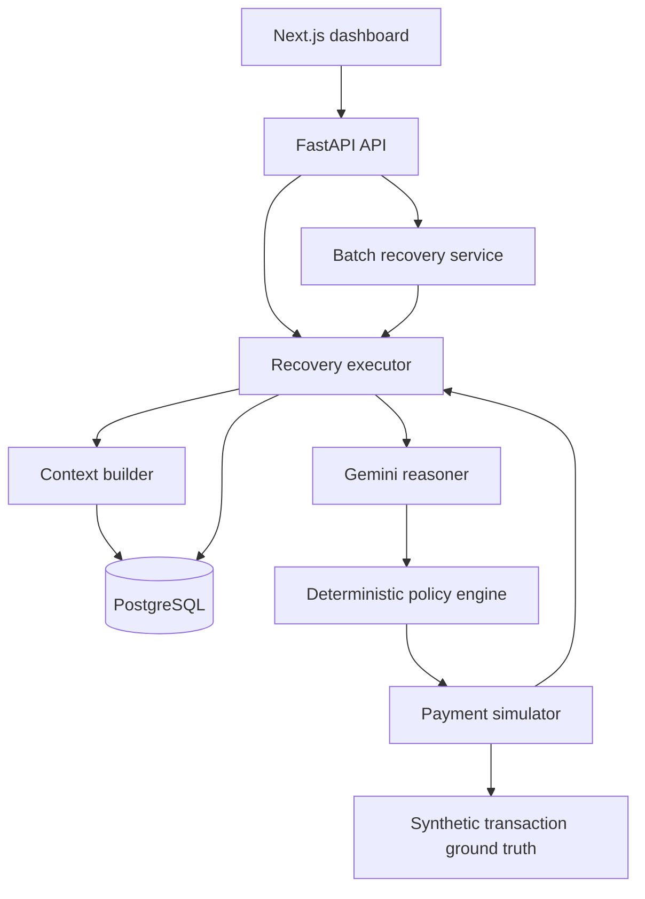
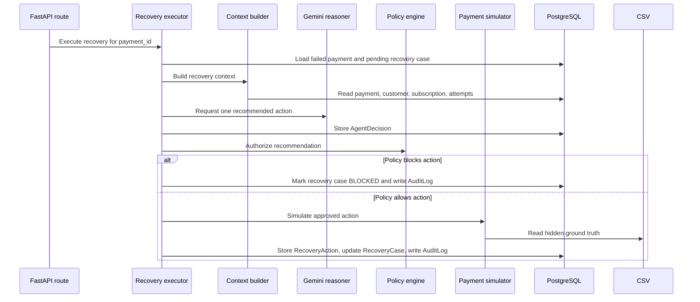

# RazorRecover

RazorRecover is an AI-assisted payment recovery system for failed payments. It builds recovery context from payment, customer, subscription, and attempt history; asks Gemini for a recovery recommendation; validates that recommendation through deterministic policy code; executes the approved action through a simulator; and stores decisions, actions, outcomes, and audit events in PostgreSQL.

> **Gemini recommends. Deterministic policy code authorizes.**

The current implementation is a hackathon/demo-grade system. It does not execute real payments, create real payment links, or contact customers. Recovery execution is simulated against synthetic ground-truth data in `data/generated/transactions.csv`.

## Overview

RazorRecover demonstrates a controlled AI workflow for revenue recovery:

1. Identify failed payments and create recovery cases.
2. Rank recovery cases with deterministic scoring.
3. Build a sanitized context for Gemini.
4. Ask Gemini to recommend one recovery action.
5. Authorize or block the recommendation with deterministic policy rules.
6. Simulate the approved action instead of calling a real payment provider.
7. Persist the AI decision, recovery action, outcome, and audit log.

## Problem Statement

Failed payments create recoverable revenue loss, but retrying every failure or contacting every customer can create poor customer experience and operational risk. AI can help reason over context, but it should not directly execute financial actions.

RazorRecover addresses this by separating recommendation from authorization and execution.

## Solution

RazorRecover uses Gemini as a constrained recommendation agent and keeps final authority in deterministic application code. The AI sees only operational recovery context, not hidden simulation ground truth. The policy engine enforces retry and payment-state rules before any simulated action is executed.

Implemented recovery actions:

| Action | Meaning in the current implementation |
| --- | --- |
| `RETRY` | Simulates retrying a failed payment. |
| `PAYMENT_LINK` | Simulates recovering through a payment link. No real link is created. |
| `CUSTOMER_NUDGE` | Simulates a customer-facing recovery nudge. No message is sent. |
| `DO_NOT_CONTACT` | Takes no recovery action. |

## Key Features

- **AI recommendation flow** using Google Gemini with structured JSON output.
- **Deterministic fallback** when common Gemini quota or temporary availability errors occur.
- **Policy authorization layer** that blocks unsafe or invalid recommendations.
- **Synthetic payment simulator** that isolates hidden ground truth from Gemini.
- **Recovery case ranking** based on failure reason, customer history, payment amount, retry count, and active subscription status.
- **Batch recovery runner** with batch size, revenue-at-risk, delay, and consecutive-error controls.
- **Auditability** through persisted `AgentDecision`, `RecoveryAction`, and `AuditLog` records.
- **Dashboard UI** for viewing metrics, filtering recovery cases, inspecting payments, executing one recovery, and running controlled batches.

## Architecture



## Recovery Workflow



## AI Safety & Policy Architecture

Gemini is instructed to recommend only one of `RETRY`, `PAYMENT_LINK`, `CUSTOMER_NUDGE`, or `DO_NOT_CONTACT`. It must not execute actions, send messages, create payment links, make payments, invent information, or use hidden ground-truth data.

The policy engine is the authorization boundary. In `backend/app/services/policy_engine.py`, the implemented rules are:

| Rule | Behavior |
| --- | --- |
| Already successful attempt | Blocks recovery if any previous payment attempt has status `SUCCESS`; policy returns `DO_NOT_CONTACT`. |
| Retry limit | Blocks `RETRY` when `payment.retry_count >= 2`; allows it when retry count is below `2`. |
| Payment link state check | Allows `PAYMENT_LINK` only when the payment context status is `FAILED`. |
| Customer nudge state check | Allows `CUSTOMER_NUDGE` only when the payment context status is `FAILED`. |
| Do not contact | Always allows `DO_NOT_CONTACT`. |
| Unsupported action | Blocks defensively. |

The simulator is the only layer that reads synthetic ground truth such as `is_recoverable` and `optimal_action` from `data/generated/transactions.csv`.

## Batch Recovery

`backend/app/services/batch_recovery.py` processes pending recovery cases in priority order:

```text
priority = recovery_score * amount_at_risk
```

The API request model in `backend/app/api/recovery.py` supports:

| Field | Default | Validation |
| --- | ---: | --- |
| `batch_size` | `3` | `1` to `100` |
| `delay_seconds` | `15.0` | `>= 0` |
| `max_revenue_at_risk` | `100000.0` | `> 0` |
| `max_consecutive_errors` | `3` | `1` to `10` |

Implemented batch behavior:

- Selects pending cases ordered by `recovery_score * amount_at_risk`, limited by `batch_size`.
- Stops before selecting a case if the selected revenue at risk would exceed `max_revenue_at_risk`.
- Waits `delay_seconds` between processed cases after the first case.
- Calls the same single-payment recovery executor for each selected case.
- Tracks successful recoveries, failed recoveries, policy-blocked cases, deferred cases, not-selected cases, revenue at risk, recovered revenue, case recovery rate, revenue recovery rate, and stop reason.
- Stops when an exception message contains rate-limit or quota text, returning `GEMINI_QUOTA_EXCEEDED`.
- Stops after `max_consecutive_errors`, returning `MAX_CONSECUTIVE_ERRORS_REACHED`.
- Returns `MAX_REVENUE_AT_RISK_REACHED` or `BATCH_COMPLETED` when those conditions apply.

Gemini quota and temporary availability handling also exists inside `gemini_reasoner.py`: common `429` or `RESOURCE_EXHAUSTED` errors fall back to deterministic recovery logic, while common `503` or `UNAVAILABLE` errors are retried with exponential backoff before falling back.

## Tech Stack

| Area | Technology |
| --- | --- |
| Backend API | FastAPI, Uvicorn, Pydantic |
| Backend data layer | SQLAlchemy 2, Alembic, PostgreSQL via `psycopg` |
| AI client | `google-genai` |
| Data utilities | Pandas, NumPy, Faker |
| Cache/service dependency | Redis configured through environment variables and Docker Compose |
| Frontend | Next.js 16, React 19, TypeScript |
| Styling | Tailwind CSS 4 |
| Local services | Docker Compose for PostgreSQL 17 and Redis 7 |

## Project Structure

```text
.
|-- backend/
|   |-- alembic/                  # Database migrations
|   |-- app/
|   |   |-- api/recovery.py       # Recovery API routes and inline schemas
|   |   |-- core/                 # Settings and database session setup
|   |   |-- models/               # SQLAlchemy ORM models
|   |   |-- services/             # Recovery, AI, policy, simulator, seed/evaluation logic
|   |   `-- main.py               # FastAPI application
|   |-- .env.example
|   `-- requirements.txt
|-- data/
|   |-- generated/                # Synthetic CSV data used for seeding and simulation
|   `-- generators/               # Synthetic data generation utility
|-- frontend/
|   |-- app/                      # Next.js app and dashboard components
|   |-- lib/api.ts                # Frontend API client
|   |-- types/recovery.ts         # Frontend API types
|   `-- package.json
|-- docker-compose.yml            # PostgreSQL and Redis services
`-- README.md
```

There is currently no `backend/app/schemas` directory. The request and response models used by the recovery API are defined inside `backend/app/api/recovery.py`.

## Database / Data Model

The SQLAlchemy models define these tables:

| Model | Table | Purpose |
| --- | --- | --- |
| `Merchant` | `merchants` | Demo merchant owner for customers and orders. |
| `Customer` | `customers` | Customer identity, type, order counts, payment history, and lifetime value. |
| `Order` | `orders` | Merchant/customer order records. |
| `Payment` | `payments` | Payment records with transaction ID, amount, method, status, failure reason, and retry count. |
| `PaymentAttempt` | `payment_attempts` | Individual payment attempt history for a payment. |
| `Subscription` | `subscriptions` | Customer subscription plan, amount, billing cycle, status, and next payment date. |
| `RecoveryCase` | `recovery_cases` | Failed-payment recovery case, score, recoverability, recommended/approved action, status, and recovered amount. |
| `AgentDecision` | `agent_decisions` | Gemini decision, confidence, and reason summary for a recovery case. |
| `RecoveryAction` | `recovery_actions` | Approved action execution result and recovered amount. |
| `Notification` | `notifications` | Notification records in the schema; no current API sends notifications. |
| `AuditLog` | `audit_logs` | Policy block and recovery execution audit events. |

Alembic migrations are present under `backend/alembic/versions`.

## API Endpoints

Base URL when running locally:

```text
http://127.0.0.1:8000
```

| Method | Endpoint | Description |
| --- | --- | --- |
| `GET` | `/health` | Returns API health status. |
| `GET` | `/api/recovery?status=PENDING&limit=50` | Lists recovery cases. `status` is optional; `limit` must be between `1` and `100`. |
| `GET` | `/api/recovery/{payment_id}` | Returns payment details and the latest recovery case for the payment. |
| `POST` | `/api/recovery/{payment_id}/execute` | Executes the full recovery workflow for one failed payment with a pending recovery case. |
| `POST` | `/api/recovery/batch` | Runs a controlled batch recovery workflow. |

Example batch request:

```json
{
  "batch_size": 3,
  "delay_seconds": 0,
  "max_revenue_at_risk": 100000,
  "max_consecutive_errors": 3
}
```

Example batch response shape:

```json
{
  "cases_found": 3,
  "cases_processed": 3,
  "successful_recoveries": 1,
  "failed_recoveries": 2,
  "policy_blocked": 0,
  "deferred": 0,
  "not_selected": 0,
  "revenue_at_risk": 12345.67,
  "revenue_recovered": 5000.0,
  "recovery_rate": 0.3333333333,
  "revenue_recovery_rate": 0.405,
  "stop_reason": "BATCH_COMPLETED"
}
```

The values above are illustrative; actual values depend on seeded data and Gemini/fallback decisions.

## Frontend

The dashboard in `frontend/app/page.tsx` and `frontend/app/components/dashboard` implements:

- Top-level metrics for revenue at risk, revenue recovered, recovery rate, and pending cases.
- Recovery case table with search and status filtering.
- Payment inspection panel with payment details, recovery status, recommended action, approved action, amount at risk, and amount recovered.
- Single-payment recovery execution for pending cases.
- Batch recovery controls for batch size, maximum revenue at risk, and maximum consecutive errors.
- Batch result cards for processed cases, successes, failures, policy blocks, deferred cases, revenue metrics, and stop reason.

The frontend API client defaults to `http://127.0.0.1:8000` and can be overridden with `NEXT_PUBLIC_API_URL`.

## Setup & Installation

### 1. Start infrastructure

```bash
docker compose up -d
```

This starts PostgreSQL on port `5432` and Redis on port `6379`.

### 2. Configure backend environment

```bash
cd backend
cp .env.example .env
```

Set `GEMINI_API_KEY` in `backend/.env` to use Gemini. Leave credentials blank only if you intend to rely on code paths that do not call Gemini directly. `RAZORPAY_KEY_ID` and `RAZORPAY_KEY_SECRET` exist in configuration but are not used for real payment execution in the current implementation.

Required backend variables:

| Variable | Purpose |
| --- | --- |
| `DATABASE_URL` | SQLAlchemy database URL for PostgreSQL. |
| `REDIS_URL` | Redis URL loaded by settings. |
| `GEMINI_API_KEY` | Gemini API key used by `google-genai`. |
| `RAZORPAY_KEY_ID` | Present in settings; not used by the current simulator workflow. |
| `RAZORPAY_KEY_SECRET` | Present in settings; not used by the current simulator workflow. |

### 3. Install backend dependencies

```bash
python -m venv .venv
source .venv/bin/activate
pip install -r requirements.txt
```

On Windows PowerShell, activate the virtual environment with:

```powershell
.\.venv\Scripts\Activate.ps1
```

### 4. Run migrations

```bash
alembic upgrade head
```

### 5. Seed data and create recovery cases

```bash
python -m app.services.seed_database
python -m app.services.scan_recovery_cases
```

`seed_database` loads CSV files from `data/generated`. `scan_recovery_cases` creates one pending recovery case for each failed payment that does not already have a recovery case.

### 6. Install frontend dependencies

```bash
cd ../frontend
npm install
```

Optionally set the frontend API URL:

```bash
NEXT_PUBLIC_API_URL=http://127.0.0.1:8000
```

## Running the Application

Start the backend from `backend/`:

```bash
uvicorn app.main:app --reload
```

Start the frontend from `frontend/`:

```bash
npm run dev
```

Open the dashboard at:

```text
http://localhost:3000
```

API docs are available through FastAPI when the backend is running:

```text
http://127.0.0.1:8000/docs
```

## Testing / Verification

No formal test suite is currently included in the repository.

Useful verification commands:

```bash
curl http://127.0.0.1:8000/health
curl "http://127.0.0.1:8000/api/recovery?limit=5"
```

After seeding and scanning recovery cases, baseline scoring can be evaluated with:

```bash
cd backend
python -m app.services.evaluate_baseline
```

After one or more AI recovery executions have created `AgentDecision` records, AI decisions can be evaluated with:

```bash
python -m app.services.evaluate_ai
```

Frontend linting is available through:

```bash
cd frontend
npm run lint
```

## Example Workflow

```bash
docker compose up -d

cd backend
cp .env.example .env
python -m venv .venv
source .venv/bin/activate
pip install -r requirements.txt
alembic upgrade head
python -m app.services.seed_database
python -m app.services.scan_recovery_cases
uvicorn app.main:app --reload
```

In another terminal:

```bash
cd frontend
npm install
npm run dev
```

Then open `http://localhost:3000`, inspect a pending recovery case, execute a single recovery, or run a batch recovery.

## Safety & Limitations

- Payment recovery is simulated; no real payment provider action is executed.
- Payment links and customer nudges are simulated; no actual link is created and no customer message is sent.
- Gemini does not receive hidden simulation ground truth.
- The deterministic policy engine is intentionally small and currently enforces only the rules listed in this README.
- Redis is configured as an environment dependency but is not part of the current recovery execution path.
- Razorpay credentials are present in settings but not used by the current payment simulator.
- The repository does not currently include a formal automated test suite.
- Some frontend component filenames contain typos, such as `BtachRecovery.tsx` and `MerticCard.tsx`; the imports match the current filenames.

## Future Improvements

Potential next steps, not currently implemented:

- Real payment gateway integration behind the same policy boundary.
- Real notification delivery with consent, throttling, and audit controls.
- Expanded policy rules for customer contact windows, payment method restrictions, and merchant-specific configuration.
- Automated backend and frontend tests.
- Batch run persistence with a first-class `batch_runs` table.
- Authentication and merchant-level access control.
- Redis-backed job queue for asynchronous recovery batches.

## Submission / Demo Notes

For a demo, seed the database, scan failed payments, start both servers, and use the dashboard to:

1. Show pending recovery cases ranked by risk and recoverability.
2. Inspect a failed payment and its recovery decision details.
3. Execute a single pending recovery.
4. Run a small batch with `delay_seconds` set to `0` from the frontend.
5. Explain the safety boundary: Gemini recommends, deterministic policy authorizes, and the simulator executes.

## License

No license file is currently included in this repository.
